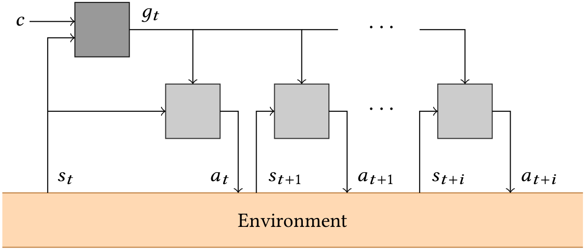
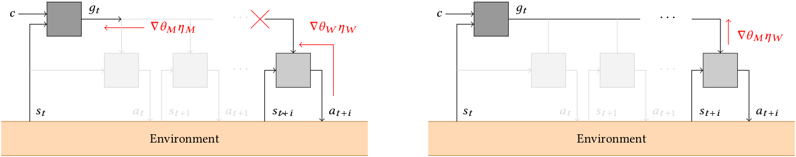
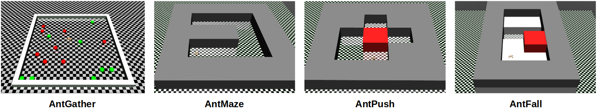
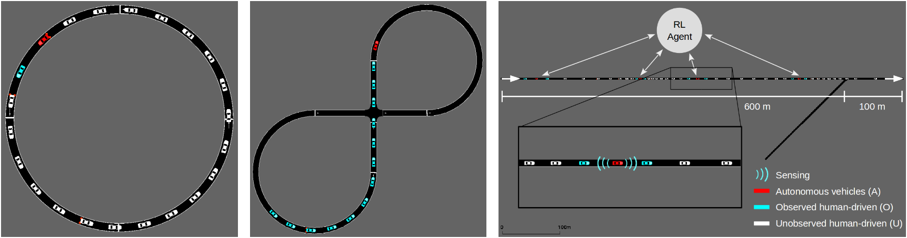

[](https://travis-ci.com/AboudyKreidieh/h-baselines)
[](https://coveralls.io/github/AboudyKreidieh/h-baselines?branch=master)
[](https://github.com/AboudyKreidieh/h-baselines/blob/master/LICENSE)

# h-baselines

`h-baselines` is a repository of high-performing and benchmarked 
hierarchical reinforcement learning models and algorithms.

The models and algorithms supported within this repository can be found 
[here](#supported-modelsalgorithms), and benchmarking results are 
available [here]().

## Contents

* [Setup Instructions](#setup-instructions)
  * [Basic Installation](#basic-installation)
  * [Installing MuJoCo](#installing-mujoco)
  * [Importing AntGather](#importing-antgather)
* [Supported Models/Algorithms](#supported-modelsalgorithms)
  * [Off-Policy RL Algorithms](#off-policy-rl-algorithms)
  * [Fully Connected Neural Networks](#fully-connected-neural-networks)
  * [Multi-Agent Fully Connected Networks](#multi-agent-fully-connected-networks)
  * [Goal-Conditioned HRL](#goal-conditioned-hrl)
  * [Meta Period](#meta-period)
  * [Intrinsic Rewards](#intrinsic-rewards)
  * [HIRO (Data Efficient Hierarchical Reinforcement Learning)](#hiro-data-efficient-hierarchical-reinforcement-learning)
  * [HAC (Learning Multi-level Hierarchies With Hindsight)](#hac-learning-multi-level-hierarchies-with-hindsight)
  * [HRL-CG (Inter-Level Cooperation in Hierarchical Reinforcement Learning)](#hrl-cg-inter-level-cooperation-in-hierarchical-reinforcement-learning)
* [Environments](#environments)
  * [MuJoCo Environments](#mujoco-environments)
  * [Flow Environments](#flow-environments)
* [Citing](#citing)
* [Bibliography](#bibliography)
* [Useful Links](#useful-links)

## Setup Instructions

### Basic Installation

To install the h-baselines repository, begin by opening a terminal and set the
working directory of the terminal to match

```bash
cd path/to/h-baselines
```

Next, create and activate a conda environment for this repository by running 
the commands in the script below. Note that this is not required, but highly 
recommended. If you do not have Anaconda on your device, refer to the provided
links to install either [Anaconda](https://www.anaconda.com/download) or
[Miniconda](https://conda.io/miniconda.html).

```bash
conda env create -f environment.yml
source activate h-baselines
```

Finally, install the contents of the repository onto your conda environment (or
your local python build) by running the following command:

```bash
pip install -e .
```

If you would like to (optionally) validate that the repository was successfully
installed and is running, you can do so by executing the unit tests as follows:

```bash
nose2
```

The test should return a message along the lines of:

    ----------------------------------------------------------------------
    Ran XXX tests in YYYs

    OK

### Installing MuJoCo

In order to run the MuJoCo environments described within the README, you
will need to install MuJoCo and the mujoco-py package. To install both
components follow the setup instructions located 
[here](https://github.com/openai/mujoco-py). This package should work 
with all versions of MuJoCo (with some changes likely to the version of 
`gym` provided); however, the algorithms have been benchmarked to 
perform well on `mujoco-py==1.50.1.68`.

### Importing AntGather

To properly import and run the AntGather environment, you will need to 
first clone and install the `rllab` library. You can do so running the 
following commands:

```
git clone https://github.com/rll/rllab.git
cd rllab
python setup.py develop
```

While all other environments run on all version of MuJoCo, this one will 
require MuJoCo-1.3.1. You may also need to install some missing packages
as well that are required by rllab. If you're installation is 
successful, the following command should not fail:

```
python experiments/run_fcnet.py "AntGather"
```

## Supported Models/Algorithms

This repository currently supports the use several algorithms  of 
goal-conditioned hierarchical reinforcement learning models.

### Off-Policy RL Algorithms

This repository supports the training of policies via two state-of-the-art 
off-policy RL algorithms: [TD3](https://arxiv.org/pdf/1802.09477.pdf) and 
[SAC](https://arxiv.org/pdf/1801.01290.pdf).

To train a policy using this algorithm, create a `OffPolicyRLAlgorithm` object 
and execute the `learn` method, providing the algorithm the proper policy 
along the process:

```python
from hbaselines.algorithms import OffPolicyRLAlgorithm
from hbaselines.fcnet.td3 import FeedForwardPolicy  # for TD3 algorithm

# create the algorithm object
alg = OffPolicyRLAlgorithm(policy=FeedForwardPolicy, env="AntGather")

# train the policy for the allotted number of timesteps
alg.learn(total_timesteps=1000000)
```

The specific algorithm that is executed is defined by the policy that is 
provided. If, for example, you would like to switch the above script to train 
a feed-forward policy using the SAC algorithm, then the policy must simply be 
changed to:

```python
from hbaselines.fcnet.sac import FeedForwardPolicy
```

The hyperparameters and modifiable features of this algorithm are as 
follows:

* **policy** (type [ hbaselines.fcnet.base.ActorCriticPolicy ]) : 
  the policy model to use
* **env** (gym.Env or str) : the environment to learn from (if 
  registered in Gym, can be str)
* **eval_env** (gym.Env or str) : the environment to evaluate from (if 
  registered in Gym, can be str)
* **nb_train_steps** (int) : the number of training steps
* **nb_rollout_steps** (int) : the number of rollout steps
* **nb_eval_episodes** (int) : the number of evaluation episodes
* **actor_update_freq** (int) : number of training steps per actor 
  policy update step. The critic policy is updated every training step.
* **meta_update_freq** (int) : number of training steps per meta policy 
  update step. The actor policy of the meta-policy is further updated at
  the frequency provided by the actor_update_freq variable. Note that 
  this value is only relevant when using the `GoalConditionedPolicy` 
  policy.
* **reward_scale** (float) : the value the reward should be scaled by
* **render** (bool) : enable rendering of the training environment
* **render_eval** (bool) : enable rendering of the evaluation environment
* **verbose** (int) : the verbosity level: 0 none, 1 training 
  information, 2 tensorflow debug
* **policy_kwargs** (dict) : policy-specific hyperparameters

### Fully Connected Neural Networks

We include a generic feed-forward neural network within the repository 
to validate the performance of typically used neural network model on 
the benchmarked environments. This consists of a pair of actor and 
critic fully connected networks with a tanh nonlinearity at the output 
layer of the actor. The output of the actors are also scaled to match 
the desired action space. 

The feed-forward policy can be imported by including the following 
script:

```python
# for TD3
from hbaselines.fcnet.td3 import FeedForwardPolicy

# for SAC
from hbaselines.fcnet.sac import FeedForwardPolicy
```

This model can then be included to the algorithm via the `policy` 
parameter. The input parameters to this policy are as follows:

The modifiable parameters of this policy are as follows:

* **sess** (tf.compat.v1.Session) : the current TensorFlow session
* **ob_space** (gym.spaces.*) : the observation space of the environment
* **ac_space** (gym.spaces.*) : the action space of the environment
* **co_space** (gym.spaces.*) : the context space of the environment
* **buffer_size** (int) : the max number of transitions to store
* **batch_size** (int) : SGD batch size
* **actor_lr** (float) : actor learning rate
* **critic_lr** (float) : critic learning rate
* **verbose** (int) : the verbosity level: 0 none, 1 training 
  information, 2 tensorflow debug
* **tau** (float) : target update rate
* **gamma** (float) : discount factor
* **layer_norm** (bool) : enable layer normalisation
* **layers** (list of int) :the size of the Neural network for the policy
* **act_fun** (tf.nn.*) : the activation function to use in the neural 
  network
* **use_huber** (bool) : specifies whether to use the huber distance 
  function as the loss for the critic. If set to False, the mean-squared 
  error metric is used instead

Additionally, TD3 policy parameters are:

* **noise** (float) : scaling term to the range of the action space, 
  that is subsequently used as the standard deviation of Gaussian noise 
  added to the action if `apply_noise` is set to True in `get_action`
* **target_policy_noise** (float) : standard deviation term to the noise
  from the output of the target actor policy. See TD3 paper for more.
* **target_noise_clip** (float) : clipping term for the noise injected 
  in the target actor policy

And SAC policy parameters are:

* **target_entropy** (float): target entropy used when learning the entropy 
  coefficient. If set to None, a heuristic value is used.

These parameters can be assigned when using the algorithm object by 
assigning them via the `policy_kwargs` term. For example, if you would 
like to train a fully connected network using the TD3 algorithm with a hidden 
size of [64, 64], this could be done as such:

```python
from hbaselines.algorithms import OffPolicyRLAlgorithm
from hbaselines.fcnet.td3 import FeedForwardPolicy  # for TD3 algorithm

# create the algorithm object
alg = OffPolicyRLAlgorithm(
    policy=FeedForwardPolicy, 
    env="AntGather",
    policy_kwargs={
        # modify the network to include a hidden shape of [64, 64]
        "layers": [64, 64],
    }
)

# train the policy for the allotted number of timesteps
alg.learn(total_timesteps=1000000)
```

All `policy_kwargs` terms that are not specified are assigned default 
parameters. These default terms are available via the following command:

```python
from hbaselines.algorithms.off_policy import FEEDFORWARD_PARAMS
print(FEEDFORWARD_PARAMS)
```

Additional algorithm-specific default policy parameters can be found via the 
following commands:

```python
# for TD3
from hbaselines.algorithms.off_policy import TD3_PARAMS
print(TD3_PARAMS)

# for SAC
from hbaselines.algorithms.off_policy import SAC_PARAMS
print(SAC_PARAMS)
```

### Multi-Agent Fully Connected Networks

In order to train multiple workers in a triangular hierarchical structure, this
repository also supports the training of multi-agent policies as well. These 
policies are import via the following commands:

```python
# for TD3
from hbaselines.multi_fcnet.td3 import MultiFeedForwardPolicy

# for SAC
from hbaselines.multi_fcnet.sac import MultiFeedForwardPolicy
```

These policy supports training off-policy variants of three popular multi-agent
algorithms:

* **Independent learners**: Independent (or Naive) learners provide a separate
  policy with independent parameters to each agent in an environment.
  Within this setting, agents are provided separate observations and reward
  signals, and store their samples and perform updates separately. A review
  of independent learners in reinforcement learning can be found here:
  https://hal.archives-ouvertes.fr/hal-00720669/document

  To train a policy using independent learners, do not modify any
  policy-specific attributes:

  ```python
  from hbaselines.algorithms.off_policy import OffPolicyRLAlgorithm
  
  alg = OffPolicyRLAlgorithm(
      policy=MultiFeedForwardPolicy,
      env="...",  # replace with an appropriate environment
      policy_kwargs={}
  )
  ```

* **Shared policies**: Unlike the independent learners formulation, shared
  policies utilize a single policy with shared parameters for all agents
  within the network. Moreover, the samples experienced by all agents are
  stored within one unified replay buffer. See the following link for an
  early review of the benefit of shared policies:
  https://citeseerx.ist.psu.edu/viewdoc/download?doi=10.1.1.55.8066&rep=rep1&type=pdf

  To train a policy using the shared policy feature, set the `shared`
  attribute to True:
  
  ```python
  from hbaselines.algorithms.off_policy import OffPolicyRLAlgorithm
  
  alg = OffPolicyRLAlgorithm(
      policy=MultiFeedForwardPolicy,
      env="...",  # replace with an appropriate environment
      policy_kwargs={
          "shared": True,
      }
  )
  ```

* **MADDPG**: We implement algorithmic-variants of MAPPG for all supported
  off-policy RL algorithms. See: https://arxiv.org/pdf/1706.02275.pdf

  To train a policy using their MADDPG variants as opposed to independent
  learners, algorithm, set the `maddpg` attribute to True:
  
  ```python
  from hbaselines.algorithms.off_policy import OffPolicyRLAlgorithm
  
    alg = OffPolicyRLAlgorithm(
      policy=MultiFeedForwardPolicy,
      env="...",  # replace with an appropriate environment
      policy_kwargs={
          "maddpg": True,
          "shared": False,  # or True
      }
  )
  ```

  This works for both shared and non-shared policies. For shared policies,
  we use a single centralized value function instead of a value function
  for each agent.

### Goal-Conditioned HRL

Goal-conditioned HRL models, also known as feudal models, are a variant 
of hierarchical models that have been widely studied in the HRL
community. This repository supports a two-level (Manager/Worker) variant
of this policy, seen in the figure below. The policy can be imported via
the following command:

```python
# for TD3
from hbaselines.goal_conditioned.td3 import GoalConditionedPolicy

# for SAC
from hbaselines.goal_conditioned.sac import GoalConditionedPolicy
```

This network consists of a high-level, or Manager, policy  that 
computes and outputs goals  every  time 
steps, and a low-level policy  that takes as inputs the current 
state and the assigned goals and is encouraged to perform actions 
 that satisfy these goals via an intrinsic 
reward function: . The contextual term, , 
parametrizes the environmental objective (e.g. desired position to move 
to), and consequently is passed both to the manager policy as well as 
the environmental reward function .

<p align="center"></p>

All of the parameters specified within the 
[Fully Connected Neural Networks](#fully-connected-neural-networks) 
section are valid for this policy as well. Further parameters are 
described in the subsequent sections below.

All `policy_kwargs` terms that are not specified are assigned default 
parameters. These default terms are available via the following command:

```python
from hbaselines.algorithms.off_policy import GOAL_CONDITIONED_PARAMS
print(GOAL_CONDITIONED_PARAMS)
```

Moreover, similar to the feed-forward policy, additional algorithm-specific 
default policy parameters can be found via the following commands:

```python
# for TD3
from hbaselines.algorithms.off_policy import TD3_PARAMS
print(TD3_PARAMS)

# for SAC
from hbaselines.algorithms.off_policy import SAC_PARAMS
print(SAC_PARAMS)
```

### Meta Period

The meta-policy action period, , can be specified to the policy during 
training by passing the term under the `meta_period` policy parameter. 
This can be assigned through the algorithm as follows:

```python
from hbaselines.algorithms import OffPolicyRLAlgorithm
from hbaselines.goal_conditioned.td3 import GoalConditionedPolicy  # for TD3 algorithm

alg = OffPolicyRLAlgorithm(
    policy=GoalConditionedPolicy,
    ...,
    policy_kwargs={
        # specify the meta-policy action period
        "meta_period": 10
    }
)
```

### Intrinsic Rewards

The intrinsic rewards, or , can have a significant 
effect on the training performance of every policy in the hierarchy. Currently,
this repository only support one intrinsic reward function: negative distance. 
This is of the form:

<p align="center"></p>

if `relative_goals` is set to False, and

<p align="center"></p>

if `relative_goals` is set to True. This attribute is described in the 
next section.

Other intrinsic rewards will be described here once included in the 
repository.

### HIRO (Data Efficient Hierarchical Reinforcement Learning)

The HIRO [3] algorithm provides two primary contributions to improve 
training of generic goal-conditioned hierarchical policies. 

First of all, the HIRO algorithm redefines the assigned goals from 
absolute desired states to relative changes in states. This is done by 
redefining the reward intrinsic rewards provided to the Worker policies 
(see the [Intrinsic Rewards](#intrinsic-rewards) section). In order to 
maintain the same absolute position of the goal regardless of state 
change, a fixed goal-transition function 
 is used in between
goal-updates by the manager policy. The goal transition function is 
accordingly defined as:

<p align="center"></p>

where  is the `meta_period`.

In order to use relative goals when training a hierarchical policy, set 
the `relative_goals` parameter to True:

```python
from hbaselines.algorithms import OffPolicyRLAlgorithm
from hbaselines.goal_conditioned.td3 import GoalConditionedPolicy  # for TD3 algorithm

alg = OffPolicyRLAlgorithm(
    policy=GoalConditionedPolicy,
    ...,
    policy_kwargs={
        # add this line to include HIRO-style relative goals
        "relative_goals": True
    }
)
```

Second, HIRO addresses the non-stationarity effects between the Manager and
Worker policies, which can have a detrimental effect particularly in off-policy 
training, by relabeling the manager actions (or goals) to make the actual 
observed action sequence more likely to have happened with respect to the 
current instantiation of the Worker policy. This is done by sampling a sequence
of potential goals sampled via a Gaussian centered at  and 
choosing the candidate goal that maximizes the log-probability of the actions 
that were originally performed by the Worker.

In order to use HIRO's goal relabeling (or off-policy corrections) procedure 
when training a hierarchical policy, set the `off_policy_corrections` parameter
to True:

```python
from hbaselines.algorithms import OffPolicyRLAlgorithm
from hbaselines.goal_conditioned.td3 import GoalConditionedPolicy  # for TD3 algorithm

alg = OffPolicyRLAlgorithm(
    policy=GoalConditionedPolicy,
    ...,
    policy_kwargs={
        # add this line to include HIRO-style off policy corrections
        "off_policy_corrections": True
    }
)
```

### HAC (Learning Multi-level Hierarchies With Hindsight)

The HAC algorithm [5] attempts to address non-stationarity between levels of a 
goal-conditioned hierarchy by employing various forms of hindsight to samples 
within the replay buffer.

**Hindsight action transitions** assist by training each subgoal policy with 
respect to a transition function that simulates the optimal lower level policy 
hierarchy. This is done by by replacing the action performed by the manager 
with the subgoal state achieved in hindsight. For example, given an original 
sub-policy transition:

    sample = {
        "meta observation": s_0,
        "meta action" g_0,
        "meta reward" r,
        "worker observations" [
            (s_0, g_0),
            (s_1, h(g_0, s_0, s_1)),
            ...
            (s_k, h(g_{k-1}, s_{k-1}, s_k))
        ],
        "worker actions" [
            a_0,
            a_1,
            ...
            a_{k-1}
        ],
        "intrinsic rewards": [
            r_w(s_0, g_0, s_1),
            r_w(s_1, h(g_0, s_0, s_1), s_2),
            ...
            r_w(s_{k-1}, h(g_{k-1}, s_{k-1}, s_k), s_k)
        ]
    }

The original goal is relabeled to match the original as follows:

    sample = {
        "meta observation": s_0,
        "meta action" s_k, <---- the changed component
        "meta reward" r,
        "worker observations" [
            (s_0, g_0),
            (s_1, h(g_0, s_0, s_1)),
            ...
            (s_k, h(g_{k-1}, s_{k-1}, s_k))
        ],
        "worker actions" [
            a_0,
            a_1,
            ...
            a_{k-1}
        ],
        "intrinsic rewards": [
            r_w(s_0, g_0, s_1),
            r_w(s_1, h(g_0, s_0, s_1), s_2),
            ...
            r_w(s_{k-1}, h(g_{k-1}, s_{k-1}, s_k), s_k)
        ]
    }

In cases when the `relative_goals` feature is being employed, the hindsight 
goal is labeled using the inverse goal transition function. In other words, for
a sample with a meta period of length , the goal for every worker for every 
worker observation indexed by  is:

<p align="center"></p>

The "meta action", as represented in the example above, is then .

**Hindsight goal transitions** extend the use of hindsight to the worker 
observations and intrinsic rewards within the sample as well. This is done by 
modifying the relevant worker-specific features as follows:

    sample = {
        "meta observation": s_0,
        "meta action" \bar{g}_0,
        "meta reward" r,
        "worker observations" [ <------------
            (s_0, \bar{g}_0),               |
            (s_1, \bar{g}_1),               |---- the changed components
            ...                             |
            (s_k, \bar{g}_k)                |
        ], <---------------------------------
        "worker actions" [
            a_0,
            a_1,
            ...
            a_{k-1}
        ],
        "intrinsic rewards": [ <----------------
            r_w(s_0, \bar{g}_0, s_1),       |
            r_w(s_1, \bar{g}_1,, s_2),      |---- the changed components
            ...                             |
            r_w(s_{k-1}, \bar{g}_k, s_k)    |
        ] <----------------------------------
    }

where  for  is equal to  if `relative_goals`
is False and is defined by the equation above if set to True.

Finally, **sub-goal testing** promotes exploration when using hindsight by 
storing the original (non-hindsight) sample in the replay buffer as well. This 
happens at a rate defined by the `subgoal_testing_rate` term.

In order to use hindsight action and goal transitions when training a 
hierarchical policy, set the `hindsight` parameter to True:

```python
from hbaselines.algorithms import OffPolicyRLAlgorithm
from hbaselines.goal_conditioned.td3 import GoalConditionedPolicy  # for TD3 algorithm

alg = OffPolicyRLAlgorithm(
    policy=GoalConditionedPolicy,
    ...,
    policy_kwargs={
        # include hindsight action and goal transitions in the replay buffer
        "hindsight": True,
        # specify the sub-goal testing rate
        "subgoal_testing_rate": 0.3
    }
)
```

### HRL-CG (Inter-Level Cooperation in Hierarchical Reinforcement Learning)

The HRL-CG algorithm [4] attempts to promote cooperation between Manager
and Worker policies in a goal-conditioned hierarchy by including a 
weighted *connected gradient* term to the Manager's gradient update 
procedure (see the right figure below).

<p align="center"></p>

Under this formulation, the Manager's update step is defined as:

<p align="center"></p>

To use the connected gradient update procedure, set the 
`connected_gradients` term in `policy_kwargs` to True. The weighting 
term ( in the above equation), can be modified via the 
`cg_weights` term (see the example below).

```python
from hbaselines.algorithms import OffPolicyRLAlgorithm
from hbaselines.goal_conditioned.td3 import GoalConditionedPolicy  # for TD3 algorithm

alg = OffPolicyRLAlgorithm(
    policy=GoalConditionedPolicy,
    ...,
    policy_kwargs={
        # add this line to include the connected gradient actor update 
        # procedure to the higher-level policies
        "connected_gradients": True,
        # specify the connected gradient (lambda) weight
        "cg_weights": 0.01
    }
)
```

## Environments

We benchmark the performance of all algorithms on a set of standardized 
[Mujoco](https://github.com/openai/mujoco-py) (robotics) and 
[Flow](https://github.com/flow-project/flow) (mixed-autonomy traffic) 
benchmarks. A description of each of the studied environments can be 
found below.

### MuJoCo Environments



**AntGather**

This task was initially provided by [6].

In this task, a quadrupedal (Ant) agent is placed in a 20x20 space with 8 
apples and 8 bombs. The agent receives a reward of +1 or collecting an apple 
and -1 for collecting a bomb. All other actions yield a reward of 0.

**AntMaze**

This task was initially provided by [3].

In this task, immovable blocks are placed to confine the agent to a
U-shaped corridor. That is, blocks are placed everywhere except at (0,0), (8,0), 
(16,0), (16,8), (16,16), (8,16), and (0,16). The agent is initialized at 
position (0,0) and tasked at reaching a specific target position. "Success" in 
this environment is defined as being within an L2 distance of 5 from the target.

**AntPush**

This task was initially provided by [3].

In this task, immovable blocks are placed every where except at 
(0,0), (-8,0), (-8,8), (0,8), (8,8), (16,8), and (0,16), and a movable block is
placed at (0,8). The agent is initialized at position (0,0), and is tasked with 
the objective of reaching position (0,19). Therefore, the agent must first move 
to the left, push the movable block to the right, and then finally navigate to 
the target. "Success" in this environment is defined as being within an L2 
distance of 5 from the target.

**AntFall**

This task was initially provided by [3].

In this task, the agent is initialized on a platform of height 4. 
Immovable blocks are placed everywhere except at (-8,0), (0,0), (-8,8), (0,8),
(-8,16), (0,16), (-8,24), and (0,24). The raised platform is absent in the 
region [-4,12]x[12,20], and a movable block is placed at (8,8). The agent is 
initialized at position (0,0,4.5), and is with the objective of reaching 
position (0,27,4.5). Therefore, to achieve this, the agent must first push the 
movable block into the chasm and walk on top of it before navigating to the 
target. "Success" in this environment is defined as being within an L2 distance 
of 5 from the target.

### Flow Environments



**Ring**

This task was initially provided by [7].

In this network, 22 vehicles are placed in a variable length single lane
ring road. In the absence of autonomous vehicles, perturbations to the 
accelerations of individuals vehicles along with the string unstable
behavior of human driving dynamics leads to the formation and 
propagation of stop-and-go waves in the network.

In the mixed-autonomy setting, a portion of vehicles are treated as AVs 
with the objective of regulating the dissipating the prevalence of 
stop-ang-go waves. The components of the MDP for this benchmark are 
defined as follows:

* States: The state consists of the relative speed and bumper-to-bumper 
  gap of the vehicles immediately preceding the AVs, as well as
  the speed of the AVs, i.e. 
  , where  is the 
  number of AVs.
* Actions: The actions consist of a list of bounded accelerations for 
  each CAV, i.e. , 
  where  and  are the minimum and maximum 
  accelerations, respectively.
* Rewards: We choose a reward function that promotes high velocities 
  while penalizing accelerations which are symptomatic of stop-and-go 
  behavior. The reward function is accordingly:
  
  <p align="center"></p>
  
  where  and  are weighting terms.

This benchmark consists of the following variations:

* ring_small: 21 humans, 1 CAV (, 
  , ).

**Figure Eight**

This task was initially provided by [8].

The figure eight network acts as a closed representation of an 
intersection. In a figure eight network containing a total of 14 
vehicles, we witness the formation of queues resulting from vehicles 
arriving simultaneously at the intersection and slowing down to obey 
right-of-way rules. This behavior significantly reduces the average 
speed of vehicles in the network.

In a mixed-autonomy setting, a portion of vehicles are treated as CAVs 
with the objective of regulating the flow of vehicles through the 
intersection in order to improve system-level velocities. The components
of the MDP for this benchmark are defined as follows:

* States: The state consists of a vector of velocities and positions for
  each vehicle in the network,ordered by the position of each vehicle,
  , where  is the number
  of vehicles in the network. Note that the position is defined relative
  to a pre-specified starting point.
* Actions: The actions are a list of accelerations for each CAV, 
  , where  is the 
  number of CAVs, and  and  are the minimum
  and maximum accelerations, respectively.
* Reward: The objective of the learning agent is to achieve high speeds
  while penalizing collisions. Accordingly, the reward function is 
  defined as follows:

  <p align="center"></p>

  where  is an arbitrary large velocity used to encourage 
  high speeds and  is the velocities of all vehicles
  in the network.

This benchmark consists of the following variations:

* figureight0: 13 humans, 1 CAV (, 
  , ).
* figureight1: 7 humans, 7 CAVs (, 
  , ).
* figureight2: 0 human, 14 CAVs (, 
  , ).

**Merge**

This task was initially provided by [8].

The merge network highlights the effect of disturbances on vehicles in a
single lane highway network. Specifically, perturbations resulting from
vehicles arriving from the on-merge lead to the formation of backwards 
propagating stop-and-go waves, thereby reducing the throughput of 
vehicles in the network. This phenomenon is known as convective 
instability.

In a mixed-autonomy setting, a percentage of vehicles in the main lane 
are tasked with the objective of dissipating the formation and 
propagation of stop-and-go waves from locally observable information. 
Moreover, given the open nature of the network, the total number of CAVs
within the network may vary at any given time. Taking these into 
account, we characterize our MDP as follows:

* States: The state consists of the speeds and bumper-to-bumper gaps of
  the vehicles immediately preceding and following the CAVs, as well as
  the speed of the CAVs, i.e. 
  .
  In order to account for variability in the number of CAVs 
  (), a constant  term is defined. When 
  , information from the extra CAVs are not
  included in the state. Moreover, if  the 
  state is padded with zeros.
* Actions: The actions consist of a list of bounded accelerations for 
  each CAV, i.e. 
  . Once 
  again, an  term is used to handle variable numbers of 
  CAVs. If  the extra CAVs are treated as
  human-driven vehicles and their states are updated using human driver
  models. Moreover, if , the extra actions 
  are ignored.
* Reward: The objective in this problem is, once again, improving 
  mobility, either via the speed of vehicles in the network or by 
  maximizing the number of vehicles that pass through the network.
  Accordingly, we use an augmented version of the reward function 
  presented for the figure eight network.

  <p align="center"></p>

  The added term penalizes small headways among the CAVs; it is minimal
  when all CAVs are spaced at . This discourages dense
  states that lead to the formation of stop-and-go traffic.

This benchmark consists of the following variations:

* merge0: 10% CAV penetration rate (, 
  , ).
* merge1: 25% CAV penetration rate (, 
  , ).
* merge2: 33.3% CAV penetration rate (, 
  , ).

**Highway**

This task was initially provided by [9].

TODO

This benchmark consists of the following variations:

* highway0: TODO

## Citing

To cite this repository in publications, use the following:

```
@misc{h-baselines,
  author = {Kreidieh, Abdul Rahman},
  title = {Hierarchical Baselines},
  year = {2019},
  publisher = {GitHub},
  journal = {GitHub repository},
  howpublished = {\url{https://github.com/AboudyKreidieh/h-baselines}},
}
```

## Bibliography

[1] Dayan, Peter, and Geoffrey E. Hinton. "Feudal reinforcement learning." 
Advances in neural information processing systems. 1993.

[2] Vezhnevets, Alexander Sasha, et al. "Feudal networks for hierarchical 
reinforcement learning." Proceedings of the 34th International Conference on 
Machine Learning-Volume 70. JMLR. org, 2017.

[3] Nachum, Ofir, et al. "Data-efficient hierarchical reinforcement learning."
Advances in Neural Information Processing Systems. 2018.

[4] Kreidieh, Abdul Rahmnan, et al. "Inter-Level Cooperation in Hierarchical 
Reinforcement Learning". arXiv preprint arXiv:1912.02368 (2019).

[5] Levy, Andrew, et al. "Learning Multi-Level Hierarchies with Hindsight." 
(2018).

[6] Florensa, Carlos, Yan Duan, and Pieter Abbeel. "Stochastic neural 
networks for hierarchical reinforcement learning." arXiv preprint 
arXiv:1704.03012 (2017).

[7] Wu, Cathy, et al. "Flow: A Modular Learning Framework for Autonomy 
in Traffic." arXiv preprint arXiv:1710.05465 (2017).

[8] Vinitsky, Eugene, et al. "Benchmarks for reinforcement learning in 
mixed-autonomy traffic." Conference on Robot Learning. 2018.

[9] TODO: highway paper

## Useful Links

The following bullet points contain links developed either by developers of
this repository or external parties that may be of use to individuals
interested in further developing their understanding of hierarchical
reinforcement learning:

* https://thegradient.pub/the-promise-of-hierarchical-reinforcement-learning/
