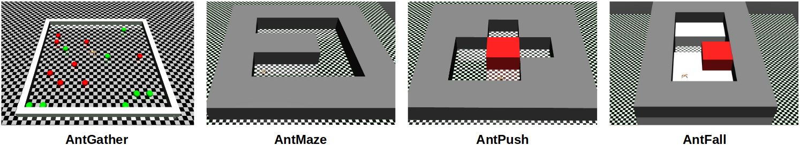

[](https://travis-ci.com/AboudyKreidieh/h-baselines)
[](https://coveralls.io/github/AboudyKreidieh/h-baselines?branch=master)
[](https://github.com/AboudyKreidieh/h-baselines/blob/master/LICENSE)

# h-baselines

`h-baselines` is a repository of high-performing and benchmarked 
hierarchical reinforcement learning models and algorithms. This repository is 
motivated by, and partially adapted from, the 
[baselines](https://github.com/openai/baselines) and 
[stable-baselines](https://github.com/hill-a/stable-baselines) repositories.

The models and algorithms supported within this repository can be found 
[here](#2-supported-modelsalgorithms), and benchmarking results are 
available [here]().

## Contents

1. [Setup Instructions](#1-setup-instructions)  
    1.1. [Basic Installation](#11-basic-installation)  
    1.2. [Installing MuJoCo](#12-installing-mujoco)  
    1.3. [Importing AntGather](#13-importing-antgather)  
2. [Supported Models/Algorithms](#2-supported-modelsalgorithms)  
    2.1. [Off-Policy RL Algorithms](#21-off-policy-rl-algorithms)  
    2.2. [Fully Connected Neural Networks](#22-fully-connected-neural-networks)  
    2.3. [Multi-Agent Fully Connected Networks](#23-multi-agent-fully-connected-networks)  
    2.4. [Goal-Conditioned HRL](#24-goal-conditioned-hrl)  
        &nbsp; &nbsp; &nbsp;&nbsp; 2.4.1. [Meta Period](#241-meta-period)  
        &nbsp; &nbsp; &nbsp;&nbsp; 2.4.2. [Intrinsic Rewards](#242-intrinsic-rewards)  
        &nbsp; &nbsp; &nbsp;&nbsp; 2.4.3. [HIRO (Data Efficient Hierarchical Reinforcement Learning)](#243-hiro-data-efficient-hierarchical-reinforcement-learning)  
        &nbsp; &nbsp; &nbsp;&nbsp; 2.4.4. [HAC (Learning Multi-level Hierarchies With Hindsight)](#244-hac-learning-multi-level-hierarchies-with-hindsight)  
        &nbsp; &nbsp; &nbsp;&nbsp; 2.4.5. [HRL-CG (Inter-Level Cooperation in Hierarchical Reinforcement Learning)](#245-hrl-cg-inter-level-cooperation-in-hierarchical-reinforcement-learning)  
3. [Environments](#3-environments)  
    3.1. [MuJoCo Environments](#31-mujoco-environments)  
    3.2. [Flow Environments](#32-flow-environments)  
4. [Citing](#4-citing)
5. [Bibliography](#5-bibliography)

# 1. Setup Instructions

## 1.1 Basic Installation

To install the h-baselines repository, begin by opening a terminal and set the
working directory of the terminal to match

```bash
cd path/to/h-baselines
```

Next, create and activate a conda environment for this repository by running 
the commands in the script below. Note that this is not required, but highly 
recommended. If you do not have Anaconda on your device, refer to the provided
links to install either [Anaconda](https://www.anaconda.com/download) or
[Miniconda](https://conda.io/miniconda.html).

```bash
conda env create -f environment.yml
source activate h-baselines
```

Finally, install the contents of the repository onto your conda environment (or
your local python build) by running the following command:

```bash
pip install -e .
```

If you would like to (optionally) validate that the repository was successfully
installed and is running, you can do so by executing the unit tests as follows:

```bash
nose2
```

The test should return a message along the lines of:

    ----------------------------------------------------------------------
    Ran XXX tests in YYYs

    OK

## 1.2 Installing MuJoCo

In order to run the MuJoCo environments described within the README, you
will need to install MuJoCo and the mujoco-py package. To install both
components follow the setup instructions located 
[here](https://github.com/openai/mujoco-py). This package should work 
with all versions of MuJoCo (with some changes likely to the version of 
`gym` provided); however, the algorithms have been benchmarked to 
perform well on `mujoco-py==1.50.1.68`.

## 1.3 Importing AntGather

To properly import and run the AntGather environment, you will need to 
first clone and install the `rllab` library. You can do so running the 
following commands:

```
git clone https://github.com/rll/rllab.git
cd rllab
python setup.py develop
git submodule add -f https://github.com/florensacc/snn4hrl.git sandbox/snn4hrl
```

While all other environments run on all version of MuJoCo, this one will 
require MuJoCo-1.3.1. You may also need to install some missing packages
as well that are required by rllab. If you're installation is 
successful, the following command should not fail:

```
python experiments/run_fcnet.py "AntGather"
```

# 2. Supported Models/Algorithms

This repository currently supports the use several algorithms  of 
goal-conditioned hierarchical reinforcement learning models.

## 2.1 Off-Policy RL Algorithms

This repository supports the training of policies via two state-of-the-art 
off-policy RL algorithms: [TD3](https://arxiv.org/pdf/1802.09477.pdf) and 
[SAC](https://arxiv.org/pdf/1801.01290.pdf).

To train a policy using this algorithm, create a `OffPolicyRLAlgorithm` object 
and execute the `learn` method, providing the algorithm the proper policy 
along the process:

```python
from hbaselines.algorithms import OffPolicyRLAlgorithm
from hbaselines.fcnet.td3 import FeedForwardPolicy  # for TD3 algorithm

# create the algorithm object
alg = OffPolicyRLAlgorithm(policy=FeedForwardPolicy, env="AntGather")

# train the policy for the allotted number of timesteps
alg.learn(total_timesteps=1000000)
```

The specific algorithm that is executed is defined by the policy that is 
provided. If, for example, you would like to switch the above script to train 
a feed-forward policy using the SAC algorithm, then the policy must simply be 
changed to:

```python
from hbaselines.fcnet.sac import FeedForwardPolicy
```

The hyperparameters and modifiable features of this algorithm are as 
follows:

* **policy** (type [ hbaselines.base_policies.ActorCriticPolicy ]) : 
  the policy model to use
* **env** (gym.Env or str) : the environment to learn from (if 
  registered in Gym, can be str)
* **eval_env** (gym.Env or str) : the environment to evaluate from (if 
  registered in Gym, can be str)
* **nb_train_steps** (int) : the number of training steps
* **nb_rollout_steps** (int) : the number of rollout steps
* **nb_eval_episodes** (int) : the number of evaluation episodes
* **actor_update_freq** (int) : number of training steps per actor 
  policy update step. The critic policy is updated every training step.
* **meta_update_freq** (int) : number of training steps per meta policy 
  update step. The actor policy of the meta-policy is further updated at
  the frequency provided by the actor_update_freq variable. Note that 
  this value is only relevant when using the `GoalConditionedPolicy` 
  policy.
* **reward_scale** (float) : the value the reward should be scaled by
* **render** (bool) : enable rendering of the training environment
* **render_eval** (bool) : enable rendering of the evaluation environment
* **verbose** (int) : the verbosity level: 0 none, 1 training 
  information, 2 tensorflow debug
* **policy_kwargs** (dict) : policy-specific hyperparameters

## 2.2 Fully Connected Neural Networks

We include a generic feed-forward neural network within the repository 
to validate the performance of typically used neural network model on 
the benchmarked environments. This consists of a pair of actor and 
critic fully connected networks with a tanh nonlinearity at the output 
layer of the actor. The output of the actors are also scaled to match 
the desired action space. 

The feed-forward policy can be imported by including the following 
script:

```python
# for TD3
from hbaselines.fcnet.td3 import FeedForwardPolicy

# for SAC
from hbaselines.fcnet.sac import FeedForwardPolicy
```

This model can then be included to the algorithm via the `policy` 
parameter. The input parameters to this policy are as follows:

The modifiable parameters of this policy are as follows:

* **sess** (tf.compat.v1.Session) : the current TensorFlow session
* **ob_space** (gym.spaces.*) : the observation space of the environment
* **ac_space** (gym.spaces.*) : the action space of the environment
* **co_space** (gym.spaces.*) : the context space of the environment
* **buffer_size** (int) : the max number of transitions to store
* **batch_size** (int) : SGD batch size
* **actor_lr** (float) : actor learning rate
* **critic_lr** (float) : critic learning rate
* **verbose** (int) : the verbosity level: 0 none, 1 training 
  information, 2 tensorflow debug
* **tau** (float) : target update rate
* **gamma** (float) : discount factor
* **layer_norm** (bool) : enable layer normalisation
* **layers** (list of int) :the size of the Neural network for the policy
* **act_fun** (tf.nn.*) : the activation function to use in the neural 
  network
* **use_huber** (bool) : specifies whether to use the huber distance 
  function as the loss for the critic. If set to False, the mean-squared 
  error metric is used instead

Additionally, TD3 policy parameters are:

* **noise** (float) : scaling term to the range of the action space, 
  that is subsequently used as the standard deviation of Gaussian noise 
  added to the action if `apply_noise` is set to True in `get_action`
* **target_policy_noise** (float) : standard deviation term to the noise
  from the output of the target actor policy. See TD3 paper for more.
* **target_noise_clip** (float) : clipping term for the noise injected 
  in the target actor policy

And SAC policy parameters are:

* **target_entropy** (float): target entropy used when learning the entropy 
  coefficient. If set to None, a heuristic value is used.

These parameters can be assigned when using the algorithm object by 
assigning them via the `policy_kwargs` term. For example, if you would 
like to train a fully connected network using the TD3 algorithm with a hidden 
size of [64, 64], this could be done as such:

```python
from hbaselines.algorithms import OffPolicyRLAlgorithm
from hbaselines.fcnet.td3 import FeedForwardPolicy  # for TD3 algorithm

# create the algorithm object
alg = OffPolicyRLAlgorithm(
    policy=FeedForwardPolicy, 
    env="AntGather",
    policy_kwargs={
        # modify the network to include a hidden shape of [64, 64]
        "layers": [64, 64],
    }
)

# train the policy for the allotted number of timesteps
alg.learn(total_timesteps=1000000)
```

All `policy_kwargs` terms that are not specified are assigned default 
parameters. These default terms are available via the following command:

```python
from hbaselines.algorithms.off_policy import FEEDFORWARD_PARAMS
print(FEEDFORWARD_PARAMS)
```

Additional algorithm-specific default policy parameters can be found via the 
following commands:

```python
# for TD3
from hbaselines.algorithms.off_policy import TD3_PARAMS
print(TD3_PARAMS)

# for SAC
from hbaselines.algorithms.off_policy import SAC_PARAMS
print(SAC_PARAMS)
```

## 2.3 Multi-Agent Fully Connected Networks

In order to train multiple workers in a triangular hierarchical structure, this
repository also supports the training of multi-agent policies as well. These 
policies are import via the following commands:

```python
# for TD3
from hbaselines.multi_fcnet.td3 import MultiFeedForwardPolicy

# for SAC
from hbaselines.multi_fcnet.sac import MultiFeedForwardPolicy
```

These policy supports training off-policy variants of three popular multi-agent
algorithms:

* **Independent learners**: Independent (or Naive) learners provide a separate
  policy with independent parameters to each agent in an environment.
  Within this setting, agents are provided separate observations and reward
  signals, and store their samples and perform updates separately. A review
  of independent learners in reinforcement learning can be found here:
  https://hal.archives-ouvertes.fr/hal-00720669/document

  To train a policy using independent learners, do not modify any
  policy-specific attributes:

  ```python
  from hbaselines.algorithms.off_policy import OffPolicyRLAlgorithm
  from hbaselines.multi_fcnet.td3 import MultiFeedForwardPolicy  # for TD3
  
  alg = OffPolicyRLAlgorithm(
      policy=MultiFeedForwardPolicy,
      env="...",  # replace with an appropriate environment
      policy_kwargs={}
  )
  ```

* **Shared policies**: Unlike the independent learners formulation, shared
  policies utilize a single policy with shared parameters for all agents
  within the network. Moreover, the samples experienced by all agents are
  stored within one unified replay buffer. See the following link for an
  early review of the benefit of shared policies:
  https://citeseerx.ist.psu.edu/viewdoc/download?doi=10.1.1.55.8066&rep=rep1&type=pdf

  To train a policy using the shared policy feature, set the `shared`
  attribute to True:
  
  ```python
  from hbaselines.algorithms.off_policy import OffPolicyRLAlgorithm
  from hbaselines.multi_fcnet.td3 import MultiFeedForwardPolicy  # for TD3
  
  alg = OffPolicyRLAlgorithm(
      policy=MultiFeedForwardPolicy,
      env="...",  # replace with an appropriate environment
      policy_kwargs={
          "shared": True,
      }
  )
  ```

* **MADDPG**: We implement algorithmic-variants of MAPPG for all supported
  off-policy RL algorithms. See: https://arxiv.org/pdf/1706.02275.pdf

  To train a policy using their MADDPG variants as opposed to independent
  learners, algorithm, set the `maddpg` attribute to True:
  
  ```python
  from hbaselines.algorithms.off_policy import OffPolicyRLAlgorithm
  from hbaselines.multi_fcnet.td3 import MultiFeedForwardPolicy  # for TD3
  
  alg = OffPolicyRLAlgorithm(
      policy=MultiFeedForwardPolicy,
      env="...",  # replace with an appropriate environment
      policy_kwargs={
          "maddpg": True,
          "shared": False,  # or True
      }
  )
  ```

  This works for both shared and non-shared policies. For shared policies,
  we use a single centralized value function instead of a value function
  for each agent.

## 2.4 Goal-Conditioned HRL

Goal-conditioned HRL models, also known as feudal models, are a variant 
of hierarchical models that have been widely studied in the HRL
community. This repository supports a two-level (Manager/Worker) variant
of this policy, seen in the figure below. The policy can be imported via
the following command:

```python
# for TD3
from hbaselines.goal_conditioned.td3 import GoalConditionedPolicy

# for SAC
from hbaselines.goal_conditioned.sac import GoalConditionedPolicy
```

This network consists of a high-level, or Manager, policy $\pi_m$ that 
computes and outputs goals $g_t \sim \pi_m(s_t, c)$ every $k$ time 
steps, and a low-level policy $\pi_w$ that takes as inputs the current 
state and the assigned goals and is encouraged to perform actions 
$a_t \sim \pi_w(s_t, g_t)$ that satisfy these goals via an intrinsic 
reward function: $r_w(s_t, g_t, s_{t+1})$. The contextual term, $c$, 
parametrizes the environmental objective (e.g. desired position to move 
to), and consequently is passed both to the manager policy as well as 
the environmental reward function $r_m(s_t,c)$.

<p align="center"></p>

All of the parameters specified within the 
[Fully Connected Neural Networks](#22-fully-connected-neural-networks) 
section are valid for this policy as well. Further parameters are 
described in the subsequent sections below.

All `policy_kwargs` terms that are not specified are assigned default 
parameters. These default terms are available via the following command:

```python
from hbaselines.algorithms.off_policy import GOAL_CONDITIONED_PARAMS
print(GOAL_CONDITIONED_PARAMS)
```

Moreover, similar to the feed-forward policy, additional algorithm-specific 
default policy parameters can be found via the following commands:

```python
# for TD3
from hbaselines.algorithms.off_policy import TD3_PARAMS
print(TD3_PARAMS)

# for SAC
from hbaselines.algorithms.off_policy import SAC_PARAMS
print(SAC_PARAMS)
```

### 2.4.1 Meta Period

The meta-policy action period, $k$, can be specified to the policy during 
training by passing the term under the `meta_period` policy parameter. 
This can be assigned through the algorithm as follows:

```python
from hbaselines.algorithms import OffPolicyRLAlgorithm
from hbaselines.goal_conditioned.td3 import GoalConditionedPolicy  # for TD3 algorithm

alg = OffPolicyRLAlgorithm(
    ...,
    policy=GoalConditionedPolicy,
    policy_kwargs={
        # specify the meta-policy action period
        "meta_period": 10
    }
)
```

### 2.4.2 Intrinsic Rewards

The intrinsic rewards, or $r_w(s_t, g_t, s_{t+1})$, define the rewards assigned
to the lower level policies for achieving goals assigned by the policies 
immediately above them. The choice of intrinsic reward can have a 
significant affect on the training performance of both the upper and lower 
level policies. Currently, this repository supports the use of two intrinsic 
reward functions:
 
* **negative_distance**: This is of the form:

  $$r_w(s_t, g_t, s_{t+1}) = -||g_t - s_{t+1}||_2$$

  if `relative_goals` is set to False, and

  $$r_w(s_t, g_t, s_{t+1}) = -||s_t + g_t - s_{t+1}||_2$$

  if `relative_goals` is set to True. This attribute is described in the 
[section on HIRO](#243-hiro-data-efficient-hierarchical-reinforcement-learning).

* **non_negative_distance**: This reward function is designed to maintain a 
  positive value within the intrinsic rewards to prevent the lower-level agents
  from being incentivized from falling/dying in environments that can terminate
  prematurely. This is done by offsetting the value by the maximum assignable 
  distance, assuming that the states always fall within the goal space 
  ($g_\text{min}$, $g_\text{max}$). This reward is of the form:

  $$r_w(s_t, g_t, s_{t+1}) = ||(g_\text{max} - g_\text{min})||_2 - ||g_t - s_{t+1}||_2$$

  if `relative_goals` is set to False, and

  $$r_w(s_t, g_t, s_{t+1}) = ||(g_\text{max} - g_\text{min})||_2 - ||s_t + g_t - s_{t+1}||_2$$

  if `relative_goals` is set to True. This attribute is described in the 
[section on HIRO](#243-hiro-data-efficient-hierarchical-reinforcement-learning).

* **exp_negative_distance**: This reward function is designed to maintain the 
  reward between 0 and 1 for environments that may terminate prematurely. This 
  is of the form:

  $$r_w(s_t, g_t, s_{t+1}) = exp(-(||g_t - s_{t+1}||_2)^2)$$

  if `relative_goals` is set to False, and

  $$r_w(s_t, g_t, s_{t+1}) = exp(-(||s_t + g_t - s_{t+1}||_2)^2)$$

  if `relative_goals` is set to True. This attribute is described in the 
[section on HIRO](#243-hiro-data-efficient-hierarchical-reinforcement-learning).

Intrinsic rewards of the form above are not scaled by the any term, and as such
may be dominated by the largest term in the goal space. To circumvent this, we 
also include a scaled variant of each of the above intrinsic rewards were the 
states and goals are divided by goal space of the higher level policies. The 
new scaled rewards are then:

$$r_{w,\text{scaled}}(s_t, g_t, s_{t+1}) = r_w(\frac{s_t}{0.5 (g_\text{max} - g_\text{min})}, \frac{g_t}{0.5 (g_\text{max} - g_\text{min})}, \frac{s_{t+1}}{0.5 (g_\text{max} - g_\text{min})})$$

where $g_\text{max}$ is the goal-space high values and $g_\text{min}$ are the 
goal-space low values. These intrinsic rewards can be used by initializing the 
string with "scaled_", for example: **scaled_negative_distance**, 
**scaled_non_negative_distance**, or **scaled_exp_negative_distance**.

To assign your choice of intrinsic rewards when training a hierarchical policy,
set the `intrinsic_reward_type` attribute to the type of intrinsic reward you 
would like to use:

```python
from hbaselines.algorithms import OffPolicyRLAlgorithm
from hbaselines.goal_conditioned.td3 import GoalConditionedPolicy  # for TD3 algorithm

alg = OffPolicyRLAlgorithm(
    ...,
    policy=GoalConditionedPolicy,
    policy_kwargs={
        # assign the intrinsic reward you would like to use
        "intrinsic_reward_type": "scaled_negative_distance"
    }
)
```


### 2.4.3 HIRO (Data Efficient Hierarchical Reinforcement Learning)

The HIRO [3] algorithm provides two primary contributions to improve 
training of generic goal-conditioned hierarchical policies. 

First of all, the HIRO algorithm redefines the assigned goals from 
absolute desired states to relative changes in states. This is done by 
redefining the reward intrinsic rewards provided to the Worker policies 
(see the [Intrinsic Rewards](#242-intrinsic-rewards) section). In order to 
maintain the same absolute position of the goal regardless of state 
change, a fixed goal-transition function 
$h(s_t,g_t,s_{t+1}) = s_t + g_t - s_{t+1}$ is used in between
goal-updates by the manager policy. The goal transition function is 
accordingly defined as:

\begin{equation*}
    g_{t+1} = 
    \begin{cases}
        \pi_m(s_t, c) & \text{if } t \text{ mod } k = 0\\
        s_t + g_t - s_{t+1} & \text{otherwise}
    \end{cases}
\end{equation*}

where $k$ is the `meta_period`.

In order to use relative goals when training a hierarchical policy, set 
the `relative_goals` parameter to True:

```python
from hbaselines.algorithms import OffPolicyRLAlgorithm
from hbaselines.goal_conditioned.td3 import GoalConditionedPolicy  # for TD3 algorithm

alg = OffPolicyRLAlgorithm(
    ...,
    policy=GoalConditionedPolicy,
    policy_kwargs={
        # add this line to include HIRO-style relative goals
        "relative_goals": True
    }
)
```

Second, HIRO addresses the non-stationarity effects between the Manager and
Worker policies, which can have a detrimental effect particularly in off-policy 
training, by relabeling the manager actions (or goals) to make the actual 
observed action sequence more likely to have happened with respect to the 
current instantiation of the Worker policy. This is done by sampling a sequence
of potential goals sampled via a Gaussian centered at $s_{t+c}-s_t$ and 
choosing the candidate goal that maximizes the log-probability of the actions 
that were originally performed by the Worker.

In order to use HIRO's goal relabeling (or off-policy corrections) procedure 
when training a hierarchical policy, set the `off_policy_corrections` parameter
to True:

```python
from hbaselines.algorithms import OffPolicyRLAlgorithm
from hbaselines.goal_conditioned.td3 import GoalConditionedPolicy  # for TD3 algorithm

alg = OffPolicyRLAlgorithm(
    ...,
    policy=GoalConditionedPolicy,
    policy_kwargs={
        # add this line to include HIRO-style off policy corrections
        "off_policy_corrections": True
    }
)
```

### 2.4.4 HAC (Learning Multi-level Hierarchies With Hindsight)

The HAC algorithm [5] attempts to address non-stationarity between levels of a 
goal-conditioned hierarchy by employing various forms of hindsight to samples 
within the replay buffer.

**Hindsight action transitions** assist by training each subgoal policy with 
respect to a transition function that simulates the optimal lower level policy 
hierarchy. This is done by by replacing the action performed by the manager 
with the subgoal state achieved in hindsight. For example, given an original 
sub-policy transition:

    sample = {
        "meta observation": s_0,
        "meta action" g_0,
        "meta reward" r,
        "worker observations" [
            (s_0, g_0),
            (s_1, h(g_0, s_0, s_1)),
            ...
            (s_k, h(g_{k-1}, s_{k-1}, s_k))
        ],
        "worker actions" [
            a_0,
            a_1,
            ...
            a_{k-1}
        ],
        "intrinsic rewards": [
            r_w(s_0, g_0, s_1),
            r_w(s_1, h(g_0, s_0, s_1), s_2),
            ...
            r_w(s_{k-1}, h(g_{k-1}, s_{k-1}, s_k), s_k)
        ]
    }

The original goal is relabeled to match the original as follows:

    sample = {
        "meta observation": s_0,
        "meta action" s_k, <---- the changed component
        "meta reward" r,
        "worker observations" [
            (s_0, g_0),
            (s_1, h(g_0, s_0, s_1)),
            ...
            (s_k, h(g_{k-1}, s_{k-1}, s_k))
        ],
        "worker actions" [
            a_0,
            a_1,
            ...
            a_{k-1}
        ],
        "intrinsic rewards": [
            r_w(s_0, g_0, s_1),
            r_w(s_1, h(g_0, s_0, s_1), s_2),
            ...
            r_w(s_{k-1}, h(g_{k-1}, s_{k-1}, s_k), s_k)
        ]
    }

In cases when the `relative_goals` feature is being employed, the hindsight 
goal is labeled using the inverse goal transition function. In other words, for
a sample with a meta period of length $k$, the goal for every worker for every 
worker observation indexed by $t$ is:

\begin{equation*}
    \bar{g}_t = 
    \begin{cases}
        0 & \text{if } t = k \\
        \bar{g}_{t+1} - s_t + s_{t+1} & \text{otherwise}
    \end{cases}
\end{equation*}

The "meta action", as represented in the example above, is then $\bar{g}_0$.

**Hindsight goal transitions** extend the use of hindsight to the worker 
observations and intrinsic rewards within the sample as well. This is done by 
modifying the relevant worker-specific features as follows:

    sample = {
        "meta observation": s_0,
        "meta action" \bar{g}_0,
        "meta reward" r,
        "worker observations" [ <------------
            (s_0, \bar{g}_0),               |
            (s_1, \bar{g}_1),               |---- the changed components
            ...                             |
            (s_k, \bar{g}_k)                |
        ], <---------------------------------
        "worker actions" [
            a_0,
            a_1,
            ...
            a_{k-1}
        ],
        "intrinsic rewards": [ <-------------
            r_w(s_0, \bar{g}_0, s_1),       |
            r_w(s_1, \bar{g}_1,, s_2),      |---- the changed components
            ...                             |
            r_w(s_{k-1}, \bar{g}_k, s_k)    |
        ] <----------------------------------
    }

where $\bar{g}_t$ for $t = [0, \dots, k]$ is equal to $s_k$ if `relative_goals`
is False and is defined by the equation above if set to True.

Finally, **sub-goal testing** promotes exploration when using hindsight by 
storing the original (non-hindsight) sample in the replay buffer as well. This 
happens at a rate defined by the `subgoal_testing_rate` term.

In order to use hindsight action and goal transitions when training a 
hierarchical policy, set the `hindsight` parameter to True:

```python
from hbaselines.algorithms import OffPolicyRLAlgorithm
from hbaselines.goal_conditioned.td3 import GoalConditionedPolicy  # for TD3 algorithm

alg = OffPolicyRLAlgorithm(
    ...,
    policy=GoalConditionedPolicy,
    policy_kwargs={
        # include hindsight action and goal transitions in the replay buffer
        "hindsight": True,
        # specify the sub-goal testing rate
        "subgoal_testing_rate": 0.3
    }
)
```

### 2.4.5 HRL-CG (Inter-Level Cooperation in Hierarchical Reinforcement Learning)

The HRL-CG algorithm [4] attempts to promote cooperation between Manager
and Worker policies in a goal-conditioned hierarchy by including a 
weighted *connected gradient* term to the Manager's gradient update 
procedure (see the right figure below).

<p align="center"></p>

Under this formulation, the Manager's update step is defined as:

\begin{aligned}
    \nabla_{\theta_m} \eta_m' =& \mathbb{E}_{s\sim p_\pi} \big[ \nabla_a Q_m (s,c,a)|_{a=\pi_m(s,c)} \nabla_{\theta_m} \pi_m(s,c)\big] \\
    & + \lambda \mathbb{E}_{s\sim p_\pi} \bigg[ \nabla_{\theta_m} g_t \nabla_g \big(r(g,s_t,\pi_w(g_t,s_t)) + \pi_w (g,s_t) \nabla_a Q_w(g_t,s_t,a)|_{a=\pi_w(g_t,s_t)}\vphantom{\int} \big) \bigg\rvert_{g=g_t} \bigg]
\end{aligned}

To use the connected gradient update procedure, set the 
`connected_gradients` term in `policy_kwargs` to True. The weighting 
term ($\lambda$ in the above equation), can be modified via the 
`cg_weights` term (see the example below).

```python
from hbaselines.algorithms import OffPolicyRLAlgorithm
from hbaselines.goal_conditioned.td3 import GoalConditionedPolicy  # for TD3 algorithm

alg = OffPolicyRLAlgorithm(
    ...,
    policy=GoalConditionedPolicy,
    policy_kwargs={
        # add this line to include the connected gradient actor update 
        # procedure to the higher-level policies
        "connected_gradients": True,
        # specify the connected gradient (lambda) weight
        "cg_weights": 0.01
    }
)
```

# 3. Environments

We benchmark the performance of all algorithms on a set of standardized 
[Mujoco](https://github.com/openai/mujoco-py) [7] (robotics) and 
[Flow](https://github.com/flow-project/flow) [8] (mixed-autonomy traffic) 
benchmarks. A description of each of the studied environments can be 
found below.

## 3.1 MuJoCo Environments



#### AntGather

This task was initially provided by [6].

In this task, a quadrupedal (Ant) agent is placed in a 20x20 space with 8 
apples and 8 bombs. The agent receives a reward of +1 or collecting an apple 
and -1 for collecting a bomb. All other actions yield a reward of 0.

#### AntMaze

This task was initially provided by [3].

In this task, immovable blocks are placed to confine the agent to a
U-shaped corridor. That is, blocks are placed everywhere except at (0,0), (8,0), 
(16,0), (16,8), (16,16), (8,16), and (0,16). The agent is initialized at 
position (0,0) and tasked at reaching a specific target position. "Success" in 
this environment is defined as being within an L2 distance of 5 from the target.

#### AntPush

This task was initially provided by [3].

In this task, immovable blocks are placed every where except at 
(0,0), (-8,0), (-8,8), (0,8), (8,8), (16,8), and (0,16), and a movable block is
placed at (0,8). The agent is initialized at position (0,0), and is tasked with 
the objective of reaching position (0,19). Therefore, the agent must first move 
to the left, push the movable block to the right, and then finally navigate to 
the target. "Success" in this environment is defined as being within an L2 
distance of 5 from the target.

#### AntFall

This task was initially provided by [3].

In this task, the agent is initialized on a platform of height 4. 
Immovable blocks are placed everywhere except at (-8,0), (0,0), (-8,8), (0,8),
(-8,16), (0,16), (-8,24), and (0,24). The raised platform is absent in the 
region [-4,12]x[12,20], and a movable block is placed at (8,8). The agent is 
initialized at position (0,0,4.5), and is with the objective of reaching 
position (0,27,4.5). Therefore, to achieve this, the agent must first push the 
movable block into the chasm and walk on top of it before navigating to the 
target. "Success" in this environment is defined as being within an L2 distance 
of 5 from the target.

## 3.2 Flow Environments

We also explore the use of hierarchical policies on a suite of mixed-autonomy
traffic control tasks, built off the [Flow](https://github.com/flow-project/flow.git) 
[8] framework for RL in microscopic (vehicle-level) traffic simulators. Within 
these environments, a subset of vehicles in any given network are replaced with
"automated" vehicles whose actions are provided on an RL policy. A description 
of the attributes of the MDP within these tasks is provided in the following 
sub-sections. Additional information can be found through the 
[environment classes](https://github.com/AboudyKreidieh/h-baselines/tree/master/hbaselines/envs/mixed_autonomy/envs) 
and 
[flow-specific parameters](https://github.com/AboudyKreidieh/h-baselines/tree/master/hbaselines/envs/mixed_autonomy/params).

<p align="center"></p>

The below table describes all available tasks within this repository to train 
on. Any of these environments can be used by passing the environment name to 
the `env` parameter in the algorithm class. The multi-agent variants of these 
environments can also be trained by adding "multiagent-" to the start of the 
environment name (e.g. "multiagent-ring-v0").

| Network type        | Environment name | number of AVs | total vehicles |   AV ratio  | inflow rate (veh/hr) | acceleration penalty | stopping penalty |
|---------------------|------------------|:-------------:|:--------------:|:-----------:|:--------------------:|:--------------------:|:----------------:|
| [ring](#ring)       | ring-v0          |       5       |     50 - 75    | 1/15 - 1/10 |          --          |          yes         |        yes       |
|                     | ring-v1          |       5       |     50 - 75    | 1/15 - 1/10 |          --          |          yes         |        no        |
|                     | ring-v2          |       5       |     50 - 75    | 1/15 - 1/10 |          --          |          no          |        no        |
| [merge](#merge)     | merge-v0         |       ~5      |       ~50      |     1/10    |         2000         |          yes         |        no        |
|                     | merge-v1         |      ~13      |       ~50      |      1/4    |         2000         |          yes         |        no        |
|                     | merge-v2         |      ~17      |       ~50      |      1/3    |         2000         |          yes         |        no        |
| [highway](#highway) | highway-v0       |      ~10      |      ~150      |     1/12    |         2215         |          yes         |        yes       |
|                     | highway-v1       |      ~10      |      ~150      |     1/12    |         2215         |          yes         |        no        |
|                     | highway-v2       |      ~10      |      ~150      |     1/12    |         2215         |          no          |        no        |
| [I-210](#i-210)     | i210-v0          |      ~50      |      ~800      |     1/15    |         10250        |          yes         |        yes       |
|                     | i210-v1          |      ~50      |      ~800      |     1/15    |         10250        |          yes         |        no        |
|                     | i210-v2          |      ~50      |      ~800      |     1/15    |         10250        |          no          |        no        |

### States

The state for any of these environments consists of the speeds and 
bumper-to-bumper gaps of the vehicles immediately preceding and following the 
AVs, as well as the speed of the AVs, i.e. 
$s := (v_{i,\text{lead}},v_{i,\text{lag}}, h_{i,\text{lag}}, h_{i,\text{lag}}, v_i), \ i \in AV$.
In single agent settings, these observations are concatenated in a single 
observation that is passed to a centralized policy.

In order to account for variability in the number of AVs ($n_\text{AV}$) in the
single agent seeting, a constant $n_\text{RL}$ term is defined. When 
$n_\text{AV} > n_\text{RL}$, information from the extra CAVs are not included 
in the state. Moreover, if $n_\text{CAV} < n_\text{RL}$ the state is padded 
with zeros.

### Actions

The actions consist of a list of bounded accelerations for each AV, i.e. 
$a\in\mathbb{R}_{[a_\text{min},a_\text{max}]}^{1}$, where $a_\text{min}$ and 
$a_\text{max}$ are the minimum and maximum accelerations, respectively. In the 
single agent setting, all actions are provided as an output from a single 
policy.

Once again, an $n_\text{RL}$ term is used to handle variable numbers of AVs in
the single agent setting. If $n_\text{AV} > n_\text{RL}$ the extra AVs are 
treated as human-driven vehicles and their states are updated using human 
driver models. Moreover, if $n_\text{AV} < n_\text{RL}$, the extra actions are
ignored.

### Rewards

The reward provided by the environment is equal to the negative vector normal 
of the distance between the speed of all vehicles in the network and a desired 
speed, and is offset by largest possible negative term to ensure non-negativity
if environments terminate prematurely. The exact mathematical formulation of 
this reward is:

\begin{equation*}
    r(v) = max\{ 0, ||v_\text{des} \cdot 1^n ||_2 - || v - v_\text{des} \cdot 1^n ||_2 \}
\end{equation*}

where $v$ is the speed of the individual vehicles, $v_\text{des}$ is the 
desired speed, and $n$ is the number of vehicles in the network.

This reward may only include two penalties:

* **acceleration penalty:** If set to True in env_params, the negative of the 
  sum of squares of the accelerations by the AVs is added to the reward.
* **stopping penalty:** If set to True in env_params, a penalty of -5 is added 
  to the reward for every RL vehicle that is not moving.

### Networks

We investigate the performance of our algorithms on a variety of network 
configurations demonstrating diverse traffic instabilities and forms of 
congestion. This networks are detailed below.

#### ring

This scenario consists of 50 (if density is fixed) or 50-75 vehicles (5 of
which are automated) are placed on a sing-lane circular track of length 1500m.
In the absence of the automated vehicle, the human-driven vehicles exhibit 
stop-and-go instabilities brought about by the string-unstable characteristic 
of human car-following dynamics.

#### merge

This scenarios is adapted from the following article [9]. It consists of a 
single-lane highway network with an on-ramp used to generate periodic 
perturbations to sustain congested behavior. In order to model the effect of p%
AV penetration on the network, every 100/pth vehicle is replaced with an 
automated vehicle whose actions are sampled from an RL policy.

#### highway

This scenario consists of a single lane highway in which downstream traffic 
instabilities brought about by an edge with a reduced speed limit generate 
congestion in the form of stop-and-go waves. In order to model the effect of p%
AV penetration on the network, every 100/pth vehicle is replaced with an 
automated vehicle whose actions are sampled from an RL policy.

#### I-210

This scenario is a recreation of a subsection of the I-210 network in Los 
Angeles, CA. For the moment, the on-ramps and off-ramps are disabled within 
this network, rendering it similar to a multi-lane variant of the highway 
network.

# 4. Citing

To cite this repository in publications, use the following:

```
@misc{h-baselines,
  author = {Kreidieh, Abdul Rahman},
  title = {Hierarchical Baselines},
  year = {2019},
  publisher = {GitHub},
  journal = {GitHub repository},
  howpublished = {\url{https://github.com/AboudyKreidieh/h-baselines}},
}
```

# 5. Bibliography

[1] Dayan, Peter, and Geoffrey E. Hinton. "Feudal reinforcement learning." 
Advances in neural information processing systems. 1993.

[2] Vezhnevets, Alexander Sasha, et al. "Feudal networks for hierarchical 
reinforcement learning." Proceedings of the 34th International Conference on 
Machine Learning-Volume 70. JMLR. org, 2017.

[3] Nachum, Ofir, et al. "Data-efficient hierarchical reinforcement learning."
Advances in Neural Information Processing Systems. 2018.

[4] Kreidieh, Abdul Rahmnan, et al. "Inter-Level Cooperation in Hierarchical 
Reinforcement Learning". arXiv preprint arXiv:1912.02368 (2019).

[5] Levy, Andrew, et al. "Learning Multi-Level Hierarchies with Hindsight." 
(2018).

[6] Florensa, Carlos, Yan Duan, and Pieter Abbeel. "Stochastic neural 
networks for hierarchical reinforcement learning." arXiv preprint 
arXiv:1704.03012 (2017).

[7] Todorov, Emanuel, Tom Erez, and Yuval Tassa. "Mujoco: A physics engine for 
model-based control." 2012 IEEE/RSJ International Conference on Intelligent 
Robots and Systems. IEEE, 2012.

[8] Wu, Cathy, et al. "Flow: A Modular Learning Framework for Autonomy 
in Traffic." arXiv preprint arXiv:1710.05465 (2017).

[9] Kreidieh, Abdul Rahman, Cathy Wu, and Alexandre M. Bayen. "Dissipating 
stop-and-go waves in closed and open networks via deep reinforcement learning."
2018 21st International Conference on Intelligent Transportation Systems 
(ITSC). IEEE, 2018.
